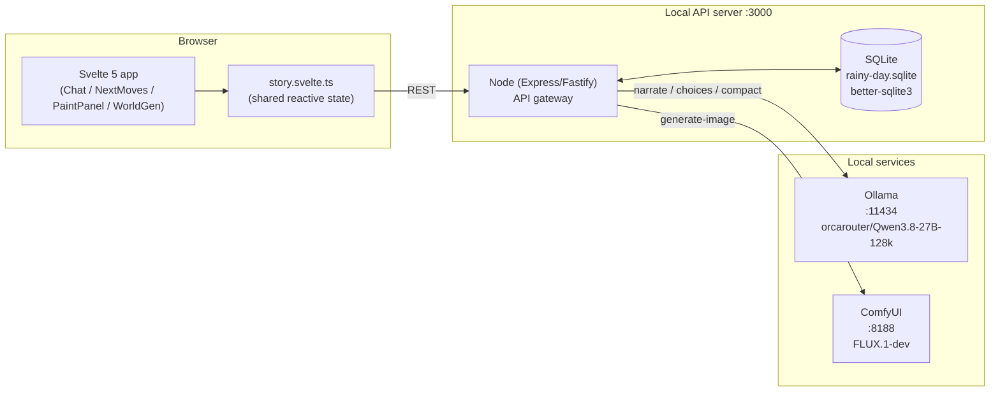
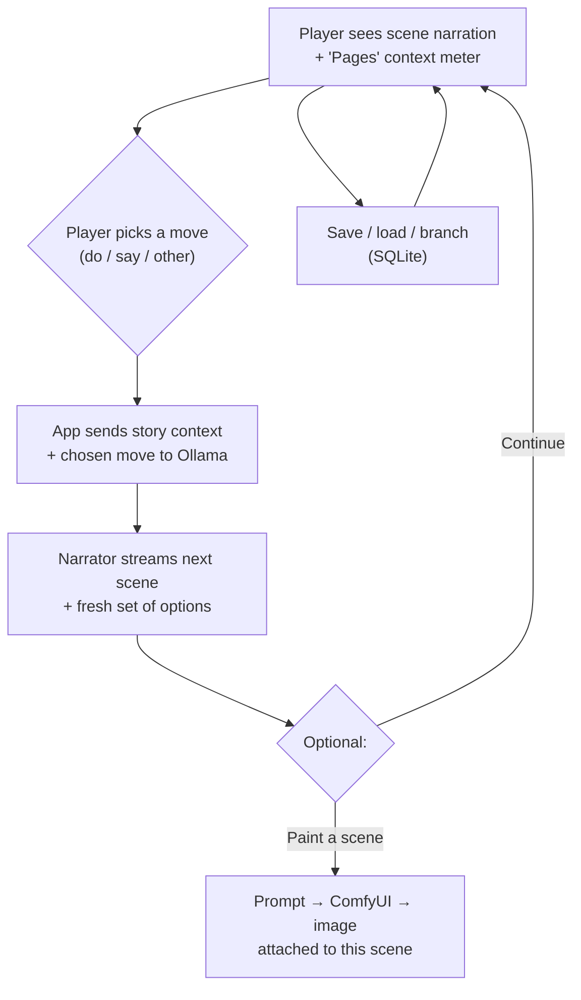

# Rainy Day LLM Stories — Working Plan

> **Status:** Draft — we walk through this together and update as we go.
> Not the README: this is the detailed design doc. The README stays a quick "what is this / how to run it".

## What it is

An ongoing, AI-driven story experience — a Perchance-style RPG where a local LLM runs the
narrative and I'm the player. Everything runs locally (Ollama + ComfyUI), no cloud.

The current app is a prototype (chat box + "paint a scene" panel). This doc is the design for
the serious version.

## System overview



- **Svelte 5 (runes)** app; shared state lives in `src/lib/story.svelte.ts` so every
  component reads/writes the same reactive store.
- **Node server (localhost:3000)** is the single API gateway: owns the SQLite file, assembles
  prompts, orchestrates LLM calls, and proxies Ollama + ComfyUI. The browser talks to *one*
  endpoint.
- **Ollama** runs the narrative: given the story so far + player's action, it produces the next
  scene (1–5 paragraphs); a **separate call** produces the available next moves.
- **ComfyUI** renders scene images from a prompt (the app can derive one, or the player writes one).
- **SQLite** (`better-sqlite3`) is the local persistence layer for worlds, characters, places,
  chapters, transcripts, world-state, saves, and images.

## Player loop (proposed)



## Story model & per-turn context

**Core idea:** the story is a sequence of **chapters**. Each chapter is a coherent arc. When a
chapter closes, a dedicated compaction call compresses its full transcript into a structured
record that stays in context for all future chapters.

**Design stance (the "saying no" problem):** LLMs are notoriously bad at enforcing what a player
*can't* do. So instead of a playable character with hard mechanical state (which forces the model
to police rules), characters are **world inhabitants with spec sheets** that read as *canon*, not
*rules*. A sheet states what's true about a character and what they're capable of; the narrator
uses it as material and narrates freely. Numbers are allowed but used sparingly — the emphasis is
on transferable skills (apply to many situations) and personality traits.

### What the LLM sees each turn (proposed tiers)

| Tier | Always? | Content |
|------|---------|---------|
| 0 | yes | System prompt — voice, world rules, how options/choices are produced |
| 1 | yes (compacted) | Previous chapters as structured records |
| 2 | as relevant | Character spec sheets for characters *in the current chapter*, by tier (T1/T2 full, T3 light). Tier-1 protagonist always-on. Not the whole cast — keeps context bounded as the cast grows |
| 3 | yes | Full raw transcript of the **current** chapter |

### Chapter record (compacted output) — proposed shape

```
Chapter {
  title / short summary
  majorEvents: [ { what, detail (full) } ]      // detailed
  minorEvents: [ { what, briefNote } ]          // less detail
  characters:  [ { id, eventsInvolved: [...] } ] // cross-referenced onto the character
  places:      [ { id } ]                        // where it took place
}
```

- **Chapter close is a player action.** The LLM may *suggest* closing at a natural boundary, but
  only after a minimum chapter length has been reached (so it doesn't nag on a 2-line chapter). The
  player decides.
- On close, the app runs a **dedicated compaction call** (its own prompt — not part of the narration
  call) to produce the structured chapter record, then **pops a review modal** where the player can
  read the proposed record, edit anything, and save. What the player approves is what gets stored.
- The **full raw chapter transcript is always kept** (Dexie) at fidelity. The record is the thing
  that lives in context; the transcript can be re-injected later if a detail got summarised away.

### Character spec sheet — proposed (free-text first, light numbers)

```
Character {
  name, role  // e.g. protagonist / ally / antagonist / bystander
  tier       // 1 = protagonist · 2 = immediate party · 3 = other NPCs (drives detail level)
  summary    // who they are in one paragraph
  skills:    [ free-text, transferable — "good at reading people", "can pick locks" ]
  traits:    [ personality, habits, motivations ]
  // optional numbers only if they actually drive narration (e.g. a competence tier)
  chapterHistory: [ { chapterId, eventsInvolved } ]  // appended at chapter close
}
```

### Character tiers & promotion

Characters are grouped in tiers, and the *detail level* given to each (in both the spec sheet and
injected context) scales with the tier:

| Tier | Who | Detail |
|------|-----|--------|
| 1 | The protagonist | Full sheet — richest skills/traits, always-on in context |
| 2 | Immediate party / companions | Full sheet, injected when present in the current chapter |
| 3 | Other NPCs / walk-ons | Light sheet — just enough to stay consistent; injected only when present |

**Promotion:** a character can be moved up a tier (3 → 2, or 2 → 1) when the story elevates them
(e.g. a side character becomes a companion). Promotion bumps their detail level and pulls a fuller
sheet into context. This keeps the cast bounded and the story's "center of gravity" movable without
hard mechanics.

### Places — location sheets

Places get their own **location sheets**, parallel to characters — but they may be *very small*. A
sheet states what's there, the mood, and who's associated with the place. Larger locations may carry
a simple **layout/map** the LLM can reason about (rooms, exits, notable points). *Small open: how
much a structured map helps vs. a plain text description — LLMs read descriptions well; a structured
map format is unproven. Can defer to implementation.*

### Decided in this section

- Chapter close = **player action**; LLM may suggest (min-length gate); on close a dedicated
  compaction call runs and a **review modal** lets the player edit before saving. ✅
- **Tiered characters** (1 protagonist / 2 party / 3 NPCs) with a **promotion** path; detail scales
  with tier. ✅
- **Location sheets** for places (small allowed); optional structured map for large locations
  (unproven — deferred). ✅
- **Always one main character** (a fixed protagonist spine + a reactive ensemble). The LLM tracks
  one protagonist + cast-that-responds better than it drives multiple co-equal arcs. Tier 1 = the
  spine; Tiers 2/3 = the reactive cast. ✅
- **Close-suggestion min-length gate = 5000 words** of the current chapter (chosen metric —
  human-readable, model-independent; it measures *this* chapter's length, not total context).
  Below that the LLM does not suggest wrapping. Player close is always available regardless. ✅
- **World state lives in the database** and is **updated at chapter close** (compaction call
  double-duties, or a separate call — either is fine, we're not worried about a couple of calls).
  In-chapter truth stays with the model via the raw transcript; the DB world-state object is the
  *established canon* that persists across chapters. ✅
- **Prompt = separate calls** (narration, then choices). KV cache makes the 2nd call cheap when
  the prefix is identical, so the extra round-trip is negligible. ✅
- **Per-turn prompt is sectioned** (instructions → world state → characters → main character →
  past chapter summaries → current chapter → user action → job: "take the action, build 1–5
  paragraphs incorporating it and its consequences"). ✅

## World generator (pre-story bootstrap)

Runs *before* the story begins. A **multi-step wizard** — each step is an LLM call *informed by
the previous steps* (KV cache keeps the growing prefix cheap), and each step is independently
re-runnable so one part can be updated without redoing the rest.

```
Step 0  [List existing worlds] → pick one, or "Create new"
Step 1  "Tell me about your world"       → World Name, General Description, Tags, tone/era
Step 2  "Now the major locations"        → locations + adjacency; optional map;
                                           NPC density per location (3–8 associated chars each)
Step 3  "Tell me about your protagonist" → Tier 1 spine sheet (the one you play)
Step 4  "Now the cast around them"       → optional love interest (Tier 2) + a pool of Tier 3
                                           NPCs distributed by location
Step 5  REVIEW — see everything; edit / regenerate any single step; confirm → world committed
```

- **Multi-step, not one big call.** Each step reads the prior steps' output → coherent,
  mutually-aware world instead of independent random dumps.
- **Light seed + model expansion.** You give a line ("a gruff detective in a rain-soaked noir
  city"), the model fleshes out each field. Authorship stays with you via the review step.
- **NPC pool = density-per-location** (3–8 associated characters per major location), not a fixed
  global count. Spatially distributed; the model does "people in a place" better than "random
  people in a world."
- **Love interest = optional flag.** If set, produces a Tier 2 character with relationship context.
- **Tags** are for the *app*, not the model — model suggests them, you approve in review, stored as
  a simple keyword array (no taxonomy). Used for UI filtering / quick reference.
- **Review modal is mandatory** before a world is committed (same propose→approve pattern as
  chapter close).
- **Re-entry:** "Edit world" re-opens the wizard pre-filled; any single step can be regenerated.

## Architecture: local Node server + SQLite

Moving from "pure browser + Dexie" to "browser + local API server + SQLite file." You're already
running two local services (Ollama 11434, ComfyUI 8188); a third local process fits the
everything-local model.

- **SQLite via `better-sqlite3`** — in-process, synchronous, uses the SQLite C lib directly.
  Sub-millisecond queries, real SQL (JOINs / WHERE), and a `.sqlite` file you can open in DB
  Browser. Faster than JDBC-over-the-wire, not slower.
- **Why Node, not Spring:** lighter *here* — a bare Express/Fastify server is up in well under a
  second (no JVM/Tomcat warmup), and the long pole is I/O (network to Ollama), which is exactly
  what Node's event loop is for. CPU work is light; offload to a worker thread if it ever grows.
- **The server is the single API gateway.** The browser talks to *one* endpoint, which owns the
  SQLite file *and* proxies Ollama + ComfyUI. The Svelte app gets simpler (no direct Ollama/ComfyUI
  plumbing); the server handles prompt assembly, call orchestration, and persistence.

```
Browser (Svelte 5) — REST → localhost:3000
  /api/worlds | /api/characters | /api/places | /api/chapters
  /api/transcript | /api/world-state
  /api/narrate | /api/choices | /api/compact        → proxy to Ollama
  /api/generate-image                               → proxy to ComfyUI
  /api/generate-world (wizard steps)                → proxy to Ollama
  → SQLite file: rainy-day.sqlite
```

> *Image proxying:* can stay on the existing Vite `/comfy` proxy (with the `changeOrigin: false`
> gotcha) **or** move to the Node server. Decide at implementation — either is fine.

## Schema (proposed DDL)

Flat, relational, real tables. Split **live/mutable** state from **immutable** history.

```sql
-- world (identity)
world            (id PK, name, description, tags JSON, tone, era, created_at)
place            (id PK, world_id FK, name, description, mood, layout JSON?, created_at)
character        (id PK, world_id FK, name, tier INT, role, summary,
                  skills JSON, traits JSON,
                  current_location_id FK?,        -- LIVE: committed at chapter close
                  is_love_interest BOOL, status,
                  chapter_history JSON, created_at)
location_association (character_id FK, place_id FK)  -- stable: which NPCs "belong" to a place

-- story (immutable history)
chapter          (id PK, world_id FK, seq, title, summary,
                  major_events JSON, minor_events JSON,
                  char_refs JSON, place_refs JSON, word_count INT, closed_at)
transcript       (id PK, chapter_id FK, seq, role, content, tokens?, created_at)

-- live canon state (single row per world; rewritten at chapter close)
world_state      (id PK = world_id, current_location_id, established_facts JSON,
                  open_threads JSON, active_cast_ids JSON, last_updated_at)

-- meta
save             (id PK, world_id FK, name, chapter_id FK,   -- last CLOSED chapter
                  open_transcript_id?,                        -- resume point in an OPEN chapter
                  world_state_snapshot JSON,                  -- live canon at save time
                  char_snapshot JSON,                          -- positions/tiers at save time
                  created_at)
image            (id PK, chapter_id FK, scene_seq, prompt, blob BLOB, created_at)
```

**Two-axis character location (the key separation):**
- **Affiliation** (stable) — `location_association`: *where this NPC belongs.* Drives the
  density-per-location pool.
- **Position** (live) — `character.current_location_id`: *where they are right now.* Protagonist
  + Tier 2 move; Tier 3 NPCs mostly stay at their affiliation.
- **Query when a chapter moves to a new location:** everyone *positioned* there
  (`WHERE current_location_id = ?`) **+** the NPCs *affiliated* there (the locals).
- **Position is committed at chapter close** (compaction call writes it); in-chapter movement is
  carried by the raw transcript. No mid-chapter DB churn.

## Saves & continuity

A **5000-word chapter won't fit in one sitting**, so saves are a first-class requirement, not a
nicety.

- *~~Saves & branching~~ → now in [Saves & continuity](#saves--continuity). Mid-scene saves + linear
   list decided; **branching = optional/future**; player can edit responses / re-roll with notes.he
  in-progress current-chapter transcript.
- **Mid-scene saves are supported (`Ctrl+S`).** A save need not sit on a chapter boundary. Because
  position/canon is normally committed *at chapter close*, a mid-scene save may capture a
  "chapter open, not yet compacted" state. **On load, state is rebuilt** (re-derive the open
  chapter's world state from its transcript if it wasn't committed). We accept the rebuild cost —
  it's the price of resumability and it's cheap enough.
- **Save list is linear** (`Save 1, Save 2, ...`), not a tree. 99% of use is "load my last save /
  an earlier one." The schema keeps a `chapter_id` + transcript offset so any save is restorable.
- **Branching = OPTIONAL / future.** Parked. The mutable-vs-immutable schema split already leaves a
  clean upgrade path (fork `world_state` + character rows per branch) if we ever want true parallel
  branches. Not needed now.

### Player agency over the model's output

Two controls, both lightweight, both part of the core loop (not a save feature per se):
- **Edit a model response** — the player can revise the narration/choice text that just landed
  before moving on. What the player saves is the source of truth.
- **Force a regeneration** — re-roll the last model output, optionally **with notes** ("do it again
  but make it darker / less violent"). The notes are appended to the prompt for that single
  re-roll. This is the main lever for steering without losing the thread.

## Sections to walk through (open questions)

1. ~~Story model & state shape~~ → now in [Story model & per-turn context](#story-model--per-turn-context).
2. ~~Prompt design~~ → sectioned prompt + separate calls locked in above. Remaining: exact
   system-prompt wording, token-budget allocation.
3. **Saves & branching** — **NEXT PRIORITY.** Save the whole thread? Snapshot at scenes? Allow
   branching into alternate paths from a past scene? (Must work before anything else ships.)
4. ~~World bible / character sheets~~ → now in [World generator](#world-generator-pre-story-bootstrap)
   + [Schema](#schema-proposed-ddl).
5. **Image pipeline** — **OPTIONAL / DEFERRED.** Parked until the core story loop works. When
   we get to it: player-written prompts only vs. LLM-suggested prompts per scene? Image
   naming/attachment, re-rolling, where images are stored (files vs. SQLite blob)?
6. **Session flow** — New game / continue / load. Any "campaign" concept (one long ongoing
   story) vs. many separate one-offs?
7. **UI structure** — How does the app layout change beyond a single chat column? (sidebar for
   saves/characters, image gallery, etc.)
8. **Non-goals** — What we're deliberately not doing (multiplayer, web publishing, other models,
   voice, TTS, ...).
9. ~~World generator (pre-story bootstrap)~~ → now in [World generator](#world-generator-pre-story-bootstrap).
10. ~~World-state table / schema design~~ → now in [Schema](#schema-proposed-ddl).

## Decisions log

> Append as we decide things, with the date.

| Date       | Decision | Notes |
|------------|----------|-------|
| 2026-09-21 | Chapter close is a **player action**; LLM may suggest (min-length gate); dedicated compaction call then a **review modal** for player edit before save. Full transcript always kept in Dexie. | Story model § |
| 2026-09-21 | **Tiered characters** (1 protagonist / 2 party / 3 NPCs); detail scales by tier; **promotion** path to bump a character up. | Story model § |
| 2026-09-21 | **Location sheets** for places (small allowed); optional structured map for large locations (unproven — deferred). | Story model § |
| 2026-09-21 | **Always one main character** (fixed protagonist spine + reactive ensemble). | Story model § |
| 2026-09-22 | **Close-suggestion min-length gate = 5000 words** of the current chapter. | Story model § |
| 2026-09-22 | **Prompt = separate calls** (narration, then choices); KV cache makes the 2nd call cheap. | Prompt § |
| 2026-09-22 | **Per-turn prompt is sectioned**: instructions → world state → characters → main character → past chapter summaries → current chapter → user action → job (1–5 paragraphs, incorporate action + consequences). | Prompt § |
| 2026-09-22 | **World generator = multi-step wizard** (world → locations → protagonist → cast → review), each step informed by prior steps; independently re-runnable; mandatory review before commit. | World gen § |
| 2026-09-22 | **NPC pool = density-per-location** (3–8 associated chars per location), not a fixed global count. | World gen § |
| 2026-09-22 | **Love interest = optional flag** → Tier 2 char with relationship context. | World gen § |
| 2026-09-22 | **Architecture = local Node server + SQLite** (`better-sqlite3`); Node is the API gateway owning the DB and proxying Ollama + ComfyUI. | Arch § |
| 2026-09-22 | **Character location = two-axis**: stable affiliation (`location_association`) + live position (`current_location_id`, committed at chapter close). New-location query = positioned + affiliated. | Schema § |
| 2026-09-22 | **Saves: mid-scene supported** (`Ctrl+S`), **linear list** (not a tree); state **rebuilt on load** if the chapter wasn't yet compacted. | Saves § |
| 2026-09-22 | **Branching = OPTIONAL / future** (parked). Schema leaves a clean fork-rows upgrade path. | Saves § |
| 2026-09-22 | **Player agency**: edit a model response; force re-roll optionally **with notes**. | Saves § |
